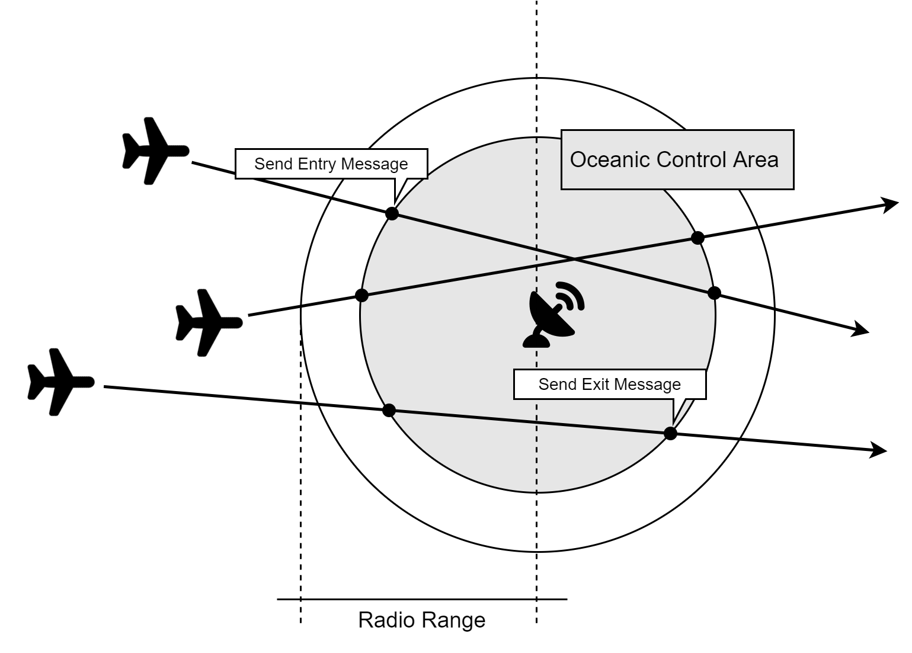

[](https://zenodo.org/badge/latestdoi/400265651)
# Trace-based Simulations of MANETs
To perform network simulations for aircraft aeronautical adhoc networks we use the following components:
- Aircraft mobility model: here we use the [BonnMotionMobility](https://doc.omnetpp.org/inet/api-current/neddoc/inet.mobility.single.BonnMotionMobility.html) model that uses aircraft traces to configure aircraft movements.
- The location of the ground station. 
- Scenario manager: here we use the [ScenarioManager](https://doc.omnetpp.org/inet/api-current/neddoc/inet.common.scenario.ScenarioManager.html) module to switch aircraft on when they enter the simulation constraint area and switch them off when they leave it.
- Data traffic application: here we use the [UdpTraceBasedApp](https://github.com/ComNetsHH).
- MAC Protocol: here we use an abstract [TdmaMac](https://github.com/ComNetsHH/omnet-tdma).
- Radio Model: here we use the [TraceBasedRadio](https://github.com/ComNetsHH).

In the following, a schematic of the scenario considered in this example is given:



## Getting Started
1. Please download [inet-4.2.5](https://github.com/inet-framework/inet/tree/v4.2.5) for OMNeT++ 5.6.2 and import it into the simulator.
    - after you import it, to use the scenario manager we need to modify "src/inet/common/scenario/ScenarioManager.cc" using the "scenario_patch.diff" patch file.
    - for that you need to run the following command from the directory containing "ScenarioManager.cc" (e.g., using your git console in case you are using windows):                    
      `patch -i <absolute-path-to-the-patch-file>/scenario_patch.diff`
2. Please clone [omnet-tdma](https://collaborating.tuhh.de/e-4/Research/omnet-tdma) and import it into OMNet++.  
To build it you need to do the following steps:
    1. INET must be set as a project reference. This is done by right-clicking on the TDMA project in the Project Explorer and navigating to `Properties-> Project References -> Select inet -> Apply and Close`    
    2. Ensure the build modes of all projects are identical (all `release` or all `debug`): This is done by right-clicking on each project in the Project Explorer and navigating to `Build Configuration -> Set Active -> <mode>`
    3. The `include paths` from INET must be added to this project such that you can write classes in your project which inherit INET classes. For that, you need to right-click on TDMA in the Project Explorer and navigate to `Properties -> OMNeT++ -> Makemake`, select the `src` folder in the list and then click `Options` in the right panel. 
    4. Go to the `Target` tab and make sure that `Shared library ...` is checked.
    5. Now go to the `Compile` tab and make sure all checkboxes are checked. 
    6. Move to the `Link` tab and make sure that the `Link with libraries exported from...` checkbox is checked. 
    7. Finally, `Apply and Close` and you should be able to `build` the TDMA project without errors as a project dependent on INET project.
3. Repeat step 2 for the `UdpTraceBasedApp` and `TraceBasedRadio` projects.
4. Please clone this repo and import it to your workspace. Then apply the same steps done above for the other projects except the following:
    1. For the step 2.1 add `inet` project as a reference and also the newly added `UdpTraceBasedApp`, `TdmaMac` and `TraceBasedRadio` projects.
    2. You can skip step 2.4.    
Now you should be able to run this example simulation project that depends on the `INET`, `UdpTraceBasedApp`, `TdmaMac` and `TraceBasedRadio` projects.    
5. Navigate to `manet-example-simulation/omnet-summit.ini` in the OMNeT++ IDE and click run. This will trigger the build of `inet` as well as `UdpTraceBasedApp`, `TdmaMac` and `TraceBasedRadio` projects and start an example simulation.
6. Run the following command in the terminal to extract the results into a .csv file using the OMNeT++'s scavetool:
```
cd ~/omnetpp/samples/manet-example-simulation/results/
scavetool export -f 'module(example_simulation.groundStation.app[*]) AND name("packetReceived:count")' -o Packet_received_100.csv scenario_100*.sca
scavetool export -f 'module(example_simulation.groundStation.app[*]) AND name("packetReceived:count")' -o Packet_received_200.csv scenario_200*.sca
scavetool export -f 'module(example_simulation.groundStation.app[*]) AND name("packetReceived:count")' -o Packet_received_300.csv scenario_300*.sca
scavetool export -f 'module(example_simulation.groundStation.app[*]) AND name("packetReceived:count")' -o Packet_received_400.csv scenario_400*.sca
scavetool export -f 'module(example_simulation.groundStation.app[*]) AND name("packetReceived:count")' -o Packet_received_500.csv scenario_500*.sca
```
7. The python result analysis script that generates the figure of the received packets and sent packets vs the number of aircraft could be run using:
```
python result_analysis_received_sent_vs_no_of_aircraft.py
```
